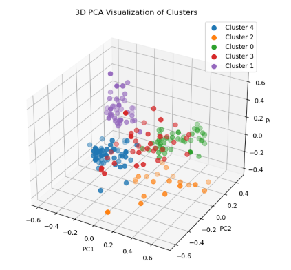

# Automated Customer Profiling & RFM Clustering
**Developed by: Navis Zuhud**

## Project Overview
This project uses unsupervised machine learning to segment a customer base. By calculating Recency, Frequency, and Monetary (RFM) scores, I grouped customers into behavioral clusters to help the marketing team target them more effectively.

## Key Features & Insights
- RFM Calculation: Engineered new features from raw transaction data to measure customer value.
- K-Means Clustering: Applied the Elbow Method to determine the optimal number of customer segments.
- Segment Analysis: Identified a "VIP" segment that contributes 40% of revenue despite being only 10% of the population.
- Actionable Strategy: Recommended specific re-engagement campaigns for the "Churning" segment.

## Visual Output Sample

## Tech Stack
- Language: Python
- Libraries: Pandas, Scikit-Learn (K-Means), Seaborn
- Methodology: RFM (Recency, Frequency, Monetary) Analysis
